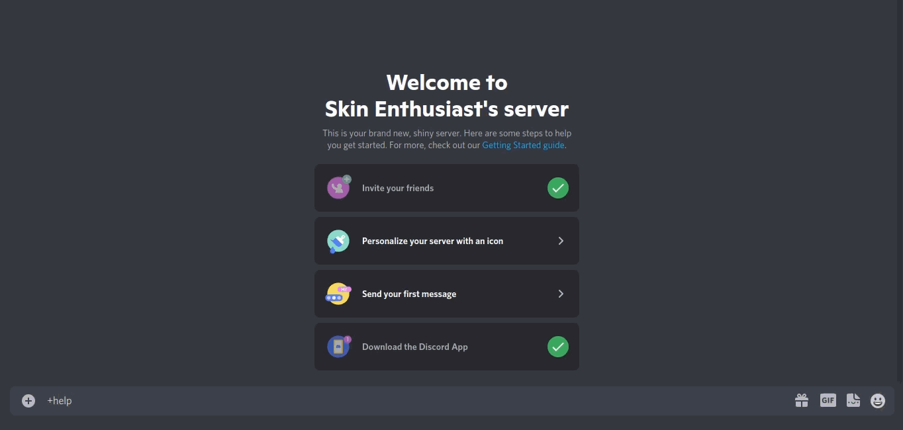
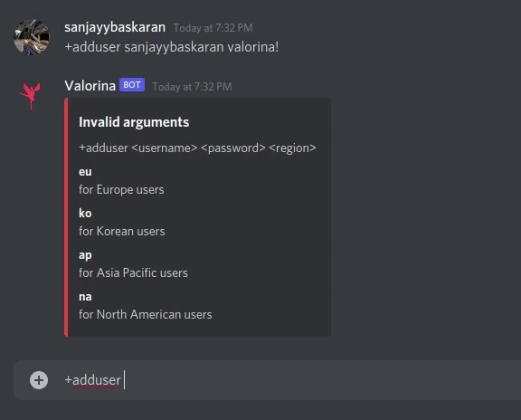
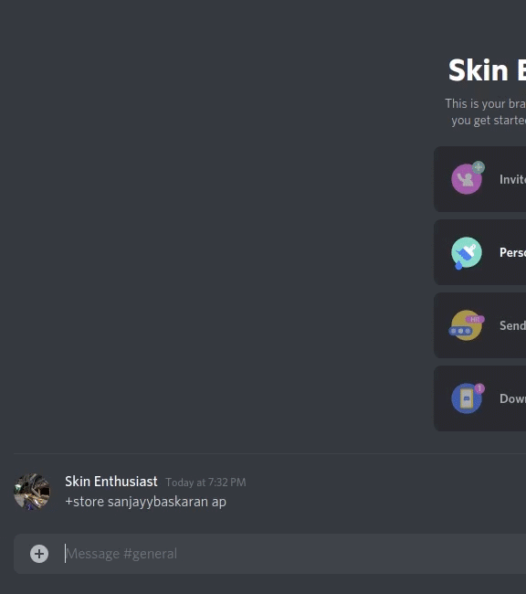
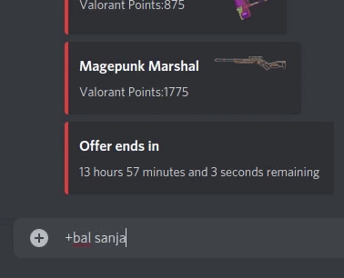
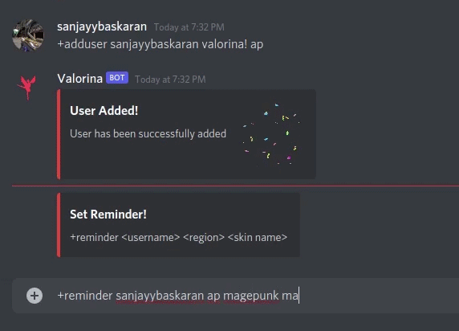
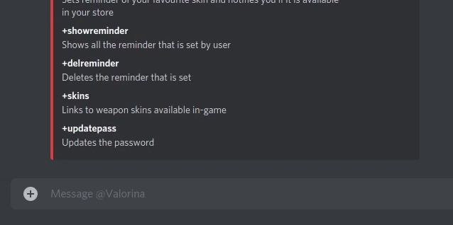

[![valorina][valorina-shield]][valorina-url]
[![Issues][issues-shield]][issues-url]

<!-- PROJECT LOGO -->
 

  

  <h3 align="center">Valorina</h3>

  

    Discord bot for all valorant skin enthusiasts!
     
     
    
  

  

    <a href="https://github.com/sanjaybaskaran01/Valorina/issues">Report Bug</a>
    ·
    <a href="https://github.com/sanjaybaskaran01/Valorina/issues">Request Feature</a>
  

<!-- TABLE OF CONTENTS -->
## Table of Contents

- [Table of Contents](#table-of-contents)
- [About The Project](#about-the-project)
  - [Built With](#built-with)
- [Features and Commands](#features-and-commands)
- [Automated Reminders](#automated-reminders)
- [Contributing](#contributing)
- [License](#license)
- [Contributors](#contributors)

<!-- ABOUT THE PROJECT -->
## About The Project

<!--  -->

Check the skins available in your store and balance using Valorina without having to open the Valorant client and get notified whenever your favourite skins are up for grabs! 🥳 🎊

### Built With 

* [Python](https://www.python.org/)
* [DiscordPy](https://discordpy.readthedocs.io/en/stable/)
* [PyMongo](https://docs.mongodb.com/drivers/pymongo/)

<!-- USAGE EXAMPLES -->

## Features and Commands

 

    +help
    Summary of all available commands

    +adduser <username> <password> <region>
    Adds the user (IN DM COMMAND)

    +store <username> <region>
    Shows all the available weapon skins in your store

    +bal <username> <region>
    Shows the balance of your account

    +reminder <username> <region> <skin name>
    Sets reminder of your favourite skin and notifies you if it is available in your store (IN DM COMMAND)
    

## Automated Reminders

<!-- CONTRIBUTING -->
## Contributing

Contributions are what make the open source community such an amazing place to be learn, inspire, and create. Any contributions you make are **greatly appreciated**.

1. Fork the Project
2. Create your Feature Branch (`git checkout -b feature/AmazingFeature`)
3. Commit your Changes (`git commit -m 'feat: Add some AmazingFeature'`)
4. Push to the Branch (`git push -u origin feature/AmazingFeature`)
5. Open a Pull Request

You are requested to follow the contribution guidelines specified in [CONTRIBUTING.md](./CONTRIBUTING.md) while contributing to the project 😊
.

<!-- LICENSE -->
## License

Distributed under the MIT License. See [`LICENSE`](./LICENSE) for more information.

<!-- MARKDOWN LINKS & IMAGES -->
<!-- https://www.markdownguide.org/basic-syntax/#reference-style-links -->
[valorina-shield]: https://img.shields.io/badge/valorina-valorina-blue
[valorina-url]: https://discord.com/oauth2/authorize?client_id=888741654482272276&permissions=2147739648&scope=bot
[issues-shield]: https://img.shields.io/github/issues/sanjaybaskaran01/Valorina
[issues-url]: https://github.com/sanjaybaskaran01/Valorina/issues

## Contributors

<table>
  <tr>
    <td align="center"><a href="https://github.com/sanjaybaskaran01"> <b>Sanjay Baskaran</b></a> </td>
    <td align="center"><a href="https://github.com/Mannan-Goyal"> <b>Mannan Goyal</b></a> </td>
    

  </tr>
</table>
